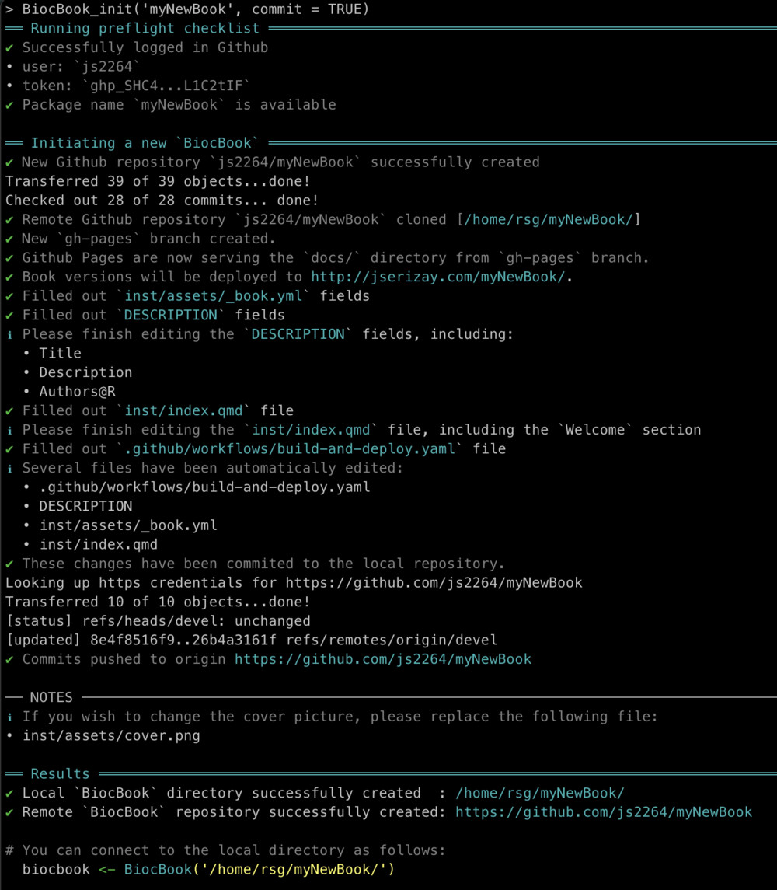

# BiocBook 

📖 **[BiocBook](https://js2264.github.io/BiocBook/devel)**   
👉 [Repo](https://github.com/js2264/BiocBook)  
👉 [Book](https://js2264.github.io/BiocBook/devel) [](https://github.com/js2264/BiocBook/actions/workflows/pages/pages-build-deployment)  
👉 [Docker](https://github.com/js2264/BiocBook/pkgs/container/BiocBook) [](https://github.com/js2264/BiocBook/actions/workflows/build-and-deploy.yaml)  

`BiocBook`s are **package-based, versioned online books** with a **supporting
`Docker` image** for each book version. 

A `BiocBook` can be created by authors (e.g. `R` developers, but also scientists, teachers, communicators, ...) who wish to: 

1. *Write*: compile a **body of biological and/or bioinformatics knowledge**;
2. *Containerize*: provide **Docker images** to reproduce the examples illustrated in the compendium;
3. *Publish*: deploy an **online book** to disseminate the compendium; 
4. *Versionize*: **automatically** generate specific online book versions and Docker images for specific [Bioconductor releases](https://contributions.bioconductor.org/use-devel.html). 

## Installation

To install the most recent version of `BiocBook`, you can use:

```r
install.packages("devtools")
devtools::install_github("js2264/BiocBook")
```

## How to create a `BiocBook`

```r
library(BiocBook)

## Make sure you have set up a Github token
gh::gh_whoami()
# check `usethis::gh_token_help()` for more information

## Create a new BiocBook
BiocBook_init("myNewPackage")

## Open the new BiocBook
bb <- BiocBook("./myNewPackage")

## Add pages
add_preamble(bb)
add_chapter(bb, title = "Chapter 1")
add_chapter(bb, title = "Chapter 2")

## Preview
BiocBook_preview(bb)

## Publish to Github
BiocBook_publish(bb)
```

## Working with `BiocBook`s
    
### 1. Creating a `BiocBook`

A new `BiocBook` should be created using the `BiocBook_init(new_package = "...")` function.  
This function performs the following operations: 

1. It checks that the provided package name is available;
2. It logs in the GitHub user accounts; 
3. It creates a new **remote** Github repository using the `BiocBook.template` from `js2264/BiocBook`; 
3. It sets up Github Pages to serve the future books from the `gh-pages` branch;
4. It clones the **remote** Github repository to a **local folder**; 
5. It edits several placeholders from the template and commits the changes. 



### 2. The `BiocBook` class

A `BiocBook` object acts as a pointer to a local package directory, with 
book chapters contained in a `pages/` folder as `.qmd` files.  

This package directory requires a specific architecture, which is 
best set up using the `BiocBook_init()` function. 


### 3. Editing an existing `BiocBook`

`BiocBook` objects can be modified using the following helper functions: 

- `add_preamble(biocbook)` to start writing a preamble; 
- `add_chapter(biocbook, title = "...")` to start writing a new chapter;  
- `edit_page(biocbook, page = "...")` to edit an existing chapter.


### 4. Publishing an existing `BiocBook`

As long as the local `BiocBook` has been initiated with `BiocBook_init()`, 
the writer simply has to commit changes and push them to the `origin` remote.  

In `R`, this can be done as follows: 

```r
BiocBook_publish(bb)
```


The different available versions published in the `origin` `gh-pages` branch 
can be listed using `BiocBook_versions(biocbook)`. 
