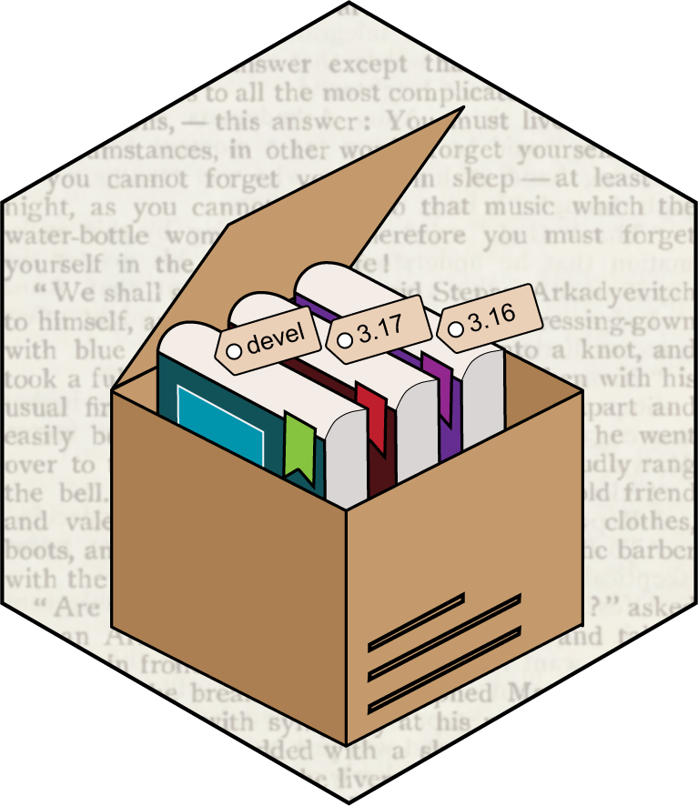

# BiocBook 

Checkout the [`{BiocBookDemo}` **package**](https://github.com/js2264/BiocBookDemo) 
and associated [**online book**](https://js2264.github.io/BiocBookDemo/devel/) 
for an example of a `BiocBook`. 

---

`BiocBook`s are **package-based, versioned online books** with a **supporting
`Docker` image** for each book version. 

A `BiocBook` can be created by authors (e.g. `R` developers, but also scientists, teachers, communicators, ...) who wish to: 

1. *Write*: compile a **body of biological and/or bioinformatics knowledge**;
2. *Containerize*: provide **Docker images** to reproduce the examples illustrated in the compendium;
3. *Publish*: deploy an **online book** to disseminate the compendium; 
4. *Version*: **automatically** generate specific online book versions and Docker images for specific [Bioconductor releases](https://contributions.bioconductor.org/use-devel.html). 

## Installation

To install `BiocBook` from Bioconductor, proceed as follows:

```r
if (!require("BiocManager", quietly = TRUE)) install.packages("BiocManager")
BiocManager::install("BiocBook")
```

To install `BiocBook` development version from Bioconductor, you can use:

```r
if (!require("BiocManager", quietly = TRUE)) install.packages("BiocManager")

BiocManager::install(version = 'devel')

BiocManager::install("BiocBook")
```

## How to create a `BiocBook`

```r
library(BiocBook)

## Make sure you have set up a Github token
gh::gh_whoami()
# check `usethis::gh_token_help()` for more information

## Create a new BiocBook
init("myNewPackage")

## Open the new BiocBook
bb <- BiocBook("./myNewPackage")

## Add pages
add_preamble(bb)
add_chapter(bb, title = "Chapter 1")
add_chapter(bb, title = "Chapter 2")

## Preview
preview(bb)

## Publish to Github
publish(bb)
```

Please read `BiocBook` vignette: `vignette("BiocBook")`. 

You can also check out the [`BiocBookDemo` book](https://js2264.github.io/BiocBookDemo/devel/) to know more about `BiocBook`. 

## Acknowledgments

This works was inspired by and closely follows the strategy used in coordination 
by the Bioconductor core team and Aaron Lun to submit book-containing 
packages (from the `OSCA` series as well as `SingleR` and `csaw` books). 

- @OSCA
- @SingleR
- @csaw

This package was also inspired by the `*down` package series, including: 

- @knitr
- @pkgdown
- @bookdown
