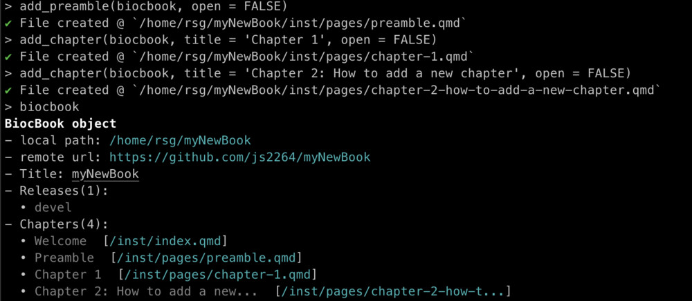

```{r setup, include = FALSE}
knitr::opts_chunk$set(
    collapse = TRUE,
    comment = "#>",
    crop = NULL ## Related to https://stat.ethz.ch/pipermail/bioc-devel/2020-April/016656.html
)
```

## 1. Creating a `BiocBook`

A new `BiocBook` should be created using the `init(new_package = "...")` function.  

This function performs the following operations: 

1. It checks that the provided package name is available;
2. It logs in the GitHub user accounts; 
3. It creates a new **remote** Github repository using the `BiocBook.template` from `js2264/BiocBook`; 
4. It sets up Github Pages to serve the future books from the `gh-pages` branch;
5. It clones the **remote** Github repository to a **local folder**; 
6. It edits several placeholders from the template and commits the changes. 


## 2. The `BiocBook` class

A `BiocBook` object acts as a pointer to a local package directory, with 
book chapters contained in a `pages/` folder as `.qmd` files.  

```{r}
library(BiocBook)
showClass("BiocBook")
```

This package directory requires a specific architecture, which is 
best set up using the `init()` function. 


## 3. Editing an existing `BiocBook`

`BiocBook` objects can be modified using the following helper functions: 

- `add_preamble(biocbook)` to start writing a preamble; 
- `add_chapter(biocbook, title = "...")` to start writing a new chapter;  
- `edit_page(biocbook, page = "...")` to edit an existing chapter.



- `preview(biocbook)` will compile (and cache) the book locally. Use it 
to verify that your book renders correctly. 

## 4. Publishing an existing `BiocBook`

As long as the local `BiocBook` has been initiated with `init()`, 
the writer simply has to commit changes and push them to the `origin` remote.  

In `R`, this can be done as follows: 

```r
publish(bb)
```


The different available versions published in the `origin` `gh-pages` branch 
can be listed using `status(biocbook)`. 

## 5. Session info 

```{r}
sessioninfo::session_info(
    installed.packages()[,"Package"], 
    include_base = TRUE
)
```
